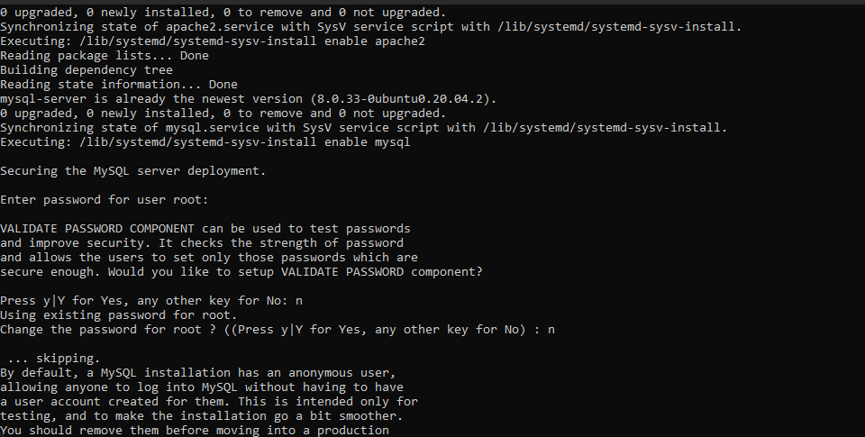

- Implement a Lampstack on AWS with bash script

- Provision EC2 instance

- Open port 80 and  22

- In the root directory create a file and name it lamp_setup.sh

```

touch lamp_setup.sh
sudo nano lamp_setup.sh

```
- Add the following  script into the file


#!/bin/bash

# Update system packages
sudo apt update
sudo apt upgrade -y

# Install Apache
sudo apt install apache2 -y

# Start and enable Apache service
sudo systemctl start apache2
sudo systemctl enable apache2

# Install MySQL Server
sudo apt install mysql-server -y

# Start and enable MySQL service
sudo systemctl start mysql
sudo systemctl enable mysql

# Run mysql_secure_installation script
sudo mysql_secure_installation

# Set the root password for MySQL
echo "ALTER USER 'root'@'localhost' IDENTIFIED WITH mysql_native_password BY 'jollof1';" | sudo mysql -u root

# Restart MySQL service
sudo systemctl restart mysql

# Display MySQL version
mysql --version

# Display completion message
echo "MySQL server setup completed!"

# Install PHP and required modules
sudo apt install php libapache2-mod-php php-mysql -y

# Restart Apache to load PHP module
sudo systemctl restart apache2

# Display PHP version
php -v

# Display Apache version
apache2 -v

# Display MySQL version
mysql --version

# Test PHP setup
echo "<?php phpinfo(); ?>" | sudo tee /var/www/html/info.php

# Display completion message
echo "LAMP stack setup completed!"


- grant the file permission and run

`chmod u+x lamp_setup.sh`

- Run the script

`sudo ./lamp_setup.sh`


# Run mysql_secure_installation script

This part of the code is going to prompt you for some configurations




- Set root password? [Y/n]:

This prompt asks if you want to set a password for the MySQL root user. You can press "Enter" to proceed with setting a password or choose "n" if you don't want to set a password at this time.

- Remove anonymous users? [Y/n]:

This prompt asks if you want to remove any anonymous user accounts in MySQL. It is generally recommended to remove anonymous users for security purposes. Press "Enter" to proceed with removing anonymous users or choose "n" if you want to keep them.

- Disallow root login remotely? [Y/n]:

This prompt asks if you want to disable remote login for the MySQL root user. It is advisable to disable remote root login for improved security. Press "Enter" to proceed with disabling remote root login or choose "n" if you want to allow it.
Remove test database and access to it? [Y/n]:

This prompt asks if you want to remove the test database and revoke access to it. The test database is usually not needed in production environments and can pose a security risk. Press "Enter" to proceed with removing the test database and access or choose "n" if you want to keep it.

- Reload privilege tables now? [Y/n]:

This prompt asks if you want to reload the privilege tables to apply the changes made during the configuration process. Press "Enter" to proceed with reloading the privilege tables or choose "n" if you prefer to do it later manually.
The purpose of the mysql_secure_installation script is to help you secure your MySQL installation by addressing common security concerns. It guides you through the process of setting a root password, removing unnecessary accounts and databases, and disabling remote root login.

[root](./images/completed.png)


- Check for mysql and php installation

[end](./images/version.png)