# Bash-Scripting
 Studying and documenting the fundamentals of Bash scripting 
Bash scripting:
Tip for scripting: Most script failures are mostly occasioned by typographical mistakes. Which are either punctuation or spelling errors by system  Administrators  working on linux servers while doing repetitive robotic tasks. In order to make work easier and less monotonous and also reduce human error these task or commands where now written in a text file and the system executes the file.  The text file that the system executes is called a Bash script. Bash Script is a text file, containing bash commands. Please note that bash is for the bash shell and  scripting for or in the bash shell is called bash scripting.

## Terminal
Terminal is the enviroment where we run or issue bash commands

## Shell
A shell is a command-line interface (CLI) that provides a user interface for interacting with an operating system or executing commands. It acts as an intermediary between the user and the operating system kernel, allowing users to enter commands and receive responses. Shells can be text-based or graphical, but the text-based shells are more common in Unix-like operating systems, including Linux.
This means that the shell interprets commands ran on the terminal.

## Key characteristics of a shell include:

- Command Interpretation:

A shell interprets the commands entered by the user and translates them into system calls or actions that the operating system can perform.

- Scripting:
Shells support scripting, allowing users to write sequences of commands in a script file, which can be executed as a program. This is a powerful feature for automation and creating custom workflows.

- Command Execution:
The shell is responsible for executing commands and managing their input and output. It also handles the execution of external programs and processes.

- Job Control:
Shells often provide job control features, allowing users to manage multiple processes, run commands in the background, or bring them to the foreground.

- Environment Variables:
Shells manage environment variables, which are dynamic values that can affect the behavior of commands and programs.

- Customization:
Users can customize their shell environment by configuring various settings, defining aliases, and creating scripts to enhance their command-line experience.
Interactive and Non-Interactive Modes:

Shells can operate in interactive mode, where they wait for user input and provide a prompt, or in non-interactive mode, where they execute commands from a script without user interaction.


### Types of shell in Linux 
- The Bourne Shell(sh) - The original Unix shell.
- The  Bourne-again-shell(bash) -The default shell on many Linux distributions
- The C shell - Designed to resemble the C programming language.
- The korn shell (ksh) An extension of the Bourne Shell with additional features.
- The Z shell(zsh) - A shell with advanced features and enhanced scripting capabilities. [types of Linux shell](https://www.digitalocean.com/community/tutorials/different-types-of-shells-in-linux)
- The choice of shell often depends on user preference, system requirements, and specific use cases. Different shells offer different features, syntax, and scripting capabilities.

### Creating Shell Scripts
- Connect to you server. (AWS Ec2)

- To prevent incompatibility issues run:

`sudo apt update`

`sudo apt upgrade -y`

- The text editor is used to create shell scripts

`touch 90DaysOfDevOps.sh` This command will create a new file

`nano 90DaysOfDevOps.sh` This will open the text editor where the scripting will be done.

This is the starting line of all bash scripts  #!/usr/bin/bash . It is also called shebang. It is the path to your bash binary.  The shebang in other words  tell the part of the interpreter.

This can be confirmed in the terminal in the terminal by running `which bash`  for  Ubuntu 

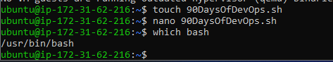

You can  also try `where is bash` from the terminal if you are not using ubuntu.

`#` This allows us to comment on particular lines in our code and provide descriptions of what the upcoming commands will be doing. I find the more notes the better for the user experience especially if this is going to be shared.

In your prefered text editor, type the following block of codes. 

```
#This  script is to demonstrate bash scripting

echo "Welcome  to bash script"

echo "The  uptime of the system is:"

uptime

echo "Memory utilization"
free -m

echo "Disk utilization"
df -h
```

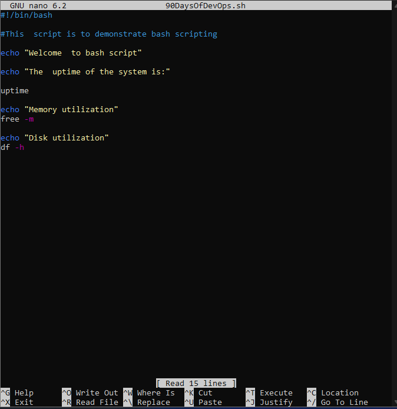

- Save and exit.

To run the script run:

`./90DaysOfDevOps.sh` A no permission message will pop up. 

- To check permissions run:

`ls -al`
This shows us that we do not not have executable right.
We have read and write but cannot execute. 

  

We use the `chmod` command to change that. To grant permission we will run:

`chmod +x 90DaysOfDevOps.sh`
If you run `ls -al` again you will see an `x` . This means that permission has been granted.

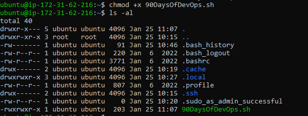

We can now run the script again 

`./90DaysOfDevOps.sh`

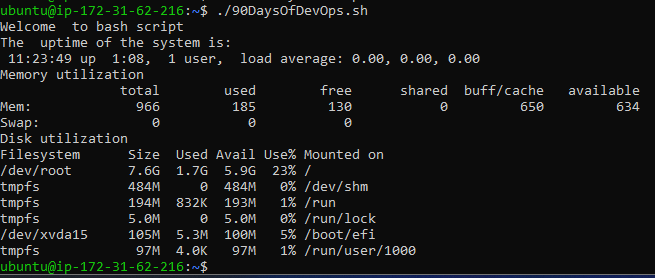

### Variables
Variables are temporary storage in the memory.

Variables are assigned with the (=) sign and called back with the ($) sign and the variable name.

Assignment of variables can be done on the terminal and in the text editor.

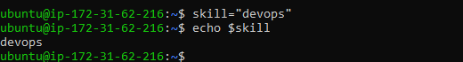

 


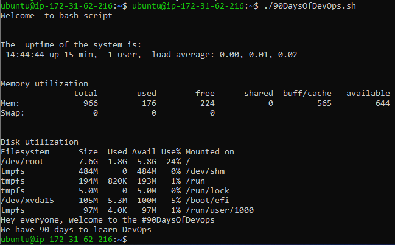

### User Input

We can also ask for user input that can set our variables using the following:

```
echo "Enter your name"
read name
echo hi $name
```


### Conditionals

`if`
`if-else`
`else-if`
These command will help us know for example, those participating in the challenge and how many days they have executed.
These commands help the script in decision making. If something fails then the script can do something else. This is basically making the script smart.

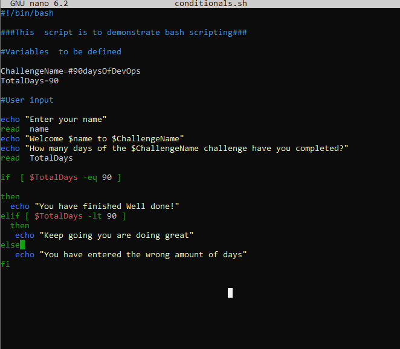

- Kindly note that this is the format for the word in the square bracket [space-word-word-space]. If this is not done,the script will not run. 

- If the script runs successfully, this should be your output 

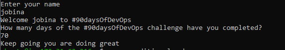

It is clear from the above, that comparisons are being made. Values are being checked against the other. Kindly note the following commands.

- `eq` - if the two values are equal will return TRUE
- `ne` - if the two values are not equal will return TRUE
- `gt` - if the first value is greater than the second value will return TRUE
- `ge` - if the first value is greater than or equal to the second value will return TRUE
- `lt` - if the first value is less than the second value will return TRUE
- `le` - if the first value is less than or equal to the second value will return TRUE
We might also use bash scripting to determine information about files and folders, this is known as file conditions.

- `-d` file True if the file is a directory
- `-e` file True if the file exists
- `-f` file True if the provided string is a file
- `-g` file True if the group id is set on a file
- `-r` file True if the file is readable
- `-s` file True if the file has a non-zero size

```
FILE="90DaysOfDevOps.txt"
if [ -f "$FILE" ]
then
  echo "$FILE is a file"
else
  echo "$FILE is not a file"
fi
```
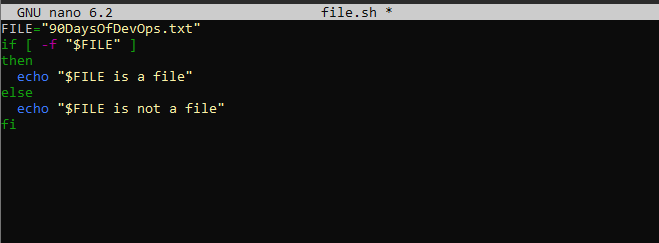

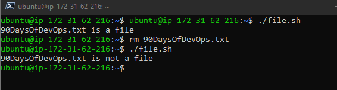

### Monitoring Scripts

The use of the question mark variable will be discussed here:
If a command runs successfully, the exit code is 0. If it doesn't the exit code will be none zero. Zero means true and none zero means false.

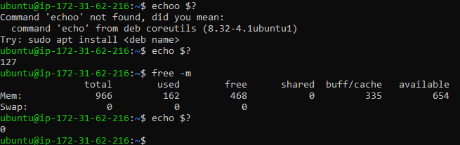


### Command Line Arguments
In Bash scripts, command line arguments, `$0` is always the name of the script. Other variables span from numbers `$1` to `$9`.
Example
Scenario: We have our company called "90DaysOfDevOps" and we have been running a while and now it is time to expand the team from 1 person to lots more over the coming weeks, I am the only one so far that knows the onboarding process so we want to reduce that bottleneck by automating some of these tasks.

Requirements:

1. A user can be passed in as a command line argument.
2. A user is created with the name of the command line argument.
3. A password can be parsed as a command line argument.
The password is set for the user
4. A message of successful account creation is displayed.

Let's start with creating our shell script with:

`touch create_user.sh`

Make the file executable using:

`chmod +x create_user.sh`

We will then run:

`nano create_user.sh` to start editing our script for the scenario we have been set.
### First requirement

"A user can be passed in as a command line argument"  To carry out this task we would do the following:

```
#! /usr/bin/bash

#A user can be passed in as a command line argument
echo "$1"

```


Now run: 
`./create_user.sh Jobina`


### Second requirement:
"A user is created with the name of command line argument" this can be done with the useradd command. The -m option is to create the user home directory as /home/username.

```
#! /usr/bin/bash

#A user can be passed in as a command line argument
echo "$1 user account being created."

#A user is created with the name of the command line argument
sudo useradd -m "$1"

```
Kindly note that this will return an error if  a user account name is not filled to variable `$1`

To check if the account was created run:

`awk -F: '{ print $1}' /etc/passwd`

The awk command you provided is used to extract information from the /etc/passwd file, which typically contains user account information on Unix-like systems. 

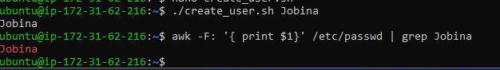

### Third requirement: 
"A password can be parsed as a command line argument." F

kindly note that this is not standard practice and will not happen in production. We are however doing this  for us to work through the list of requirements in the lab for better understanding.

```
#! /usr/bin/bash

#A user can be passed in as a command line argument
echo "$1 user account being created."

#A user is created with the name of the command line argument
sudo useradd -m "$1"

#A password can be parsed as a command line argument.
sudo chpasswd <<< "$1":"$2"

```

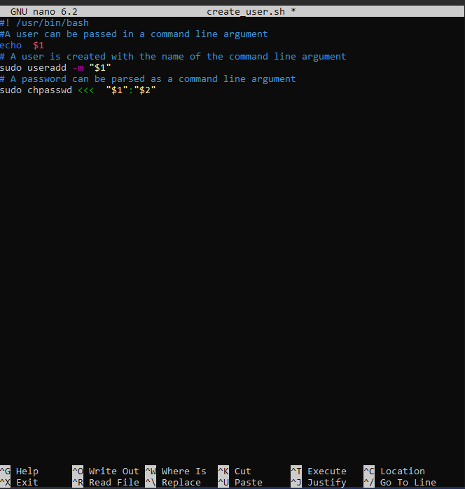

When we execute the script with:

`./create_user.sh 90DaysOfDevOps password`
A password is created in this case `pasword`

When you run `su - 90DaysOfDevOps` input our password it automatically jumped into the user created. To confirm that our user is the current user, we run the `whoami` code. See below for illustration.

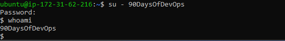

### Fourth Requirement:
The final requirement is "A message of successful account creation is displayed." 

```
#! /usr/bin/bash

echo "What is your intended username?"
read  username
echo "What is your password"
read  password

#A user can be passed in as a command line argument
echo "$username user account being created."

#A user is created with the name of the command line argument
sudo useradd -m $username

#A password can be parsed as a command line argument.
sudo chpasswd <<< $username:$password

#A message of successful account creation is displayed.

echo "The account for $username has successfully been created"

```


