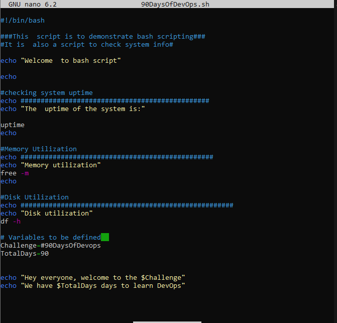

# Bash-Scripting
 Studying and documenting the fundamentals of Bash scripting 
Bash scripting:
Tip for scripting: Most script failures are mostly occasioned by typographical mistakes. Which are either punctuation or spelling errors.
System  Administrators  working on linux servers where doing repetitive robotic tasks. In order to make work easier and less monotonous and also reduce human error
these task or commands where now written in a text file and the system executes the file.  The text file that the system executes is called a Bash script.  Script is a text file, containing bash commands. Please note that bash is for the bash shell and  scripting for or in the bash shell is called bash scripting. 
### Types of shell in Linux 
- The Bourne Shell(sh)
- The  Bourne-again-shell(bash)
- The C shell
- The korn shell (ksh)
- The Z shell(zsh) [types of Linux shell](https://www.digitalocean.com/community/tutorials/different-types-of-shells-in-linux)

### Creating Shell Scripts
- Connect to you server. (AWS Ec2)

- To prevent incompatibility issues run:

`sudo apt update`

`sudo apt upgrade -y`

- The text editor is used to create shell scripts

`touch 90DaysOfDevOps.sh` This command will create a new file

`nano 90DaysOfDevOps.sh` This will open the text editor where the scripting will be done.

This is the starting line of all bash scripts  #!/usr/bin/bash . It is also called shebang. It is the path to your bash binary.  The shebang in other words  tell the part of the interpreter.

This can be confirmed in the terminal in the terminal by running `which bash`  for  Ubuntu 


You can  also try `where is bash` from the terminal if you are not using ubuntu.

`#` This allows us to comment on particular lines in our code and provide descriptions of what the upcoming commands will be doing. I find the more notes the better for the user experience especially if this is going to be shared.

In your prefered text editor, type the following block of codes. 

```
#This  script is to demonstrate bash scripting

echo "Welcome  to bash script"

echo "The  uptime of the system is:"

uptime

echo "Memory utilization"
free -m

echo "Disk utilization"
df -h
```


- Save and exit.

To run the script run:

`./90DaysOfDevOps.sh` A no permission message will pop up. 

- To check permissions run:

`ls -al`
This shows us that we do not not have executable right.
We have read and write but cannot execute. 

  

We use the `chmod` command to change that. To grant permission we will run:

`chmod +x 90DaysOfDevOps.sh`
If you run `ls -al` again you will see an `x` . This means that permission has been granted.


We can now run the script again 

`./90DaysOfDevOps.sh`


### Variables
Variables are temporary storage in the memory.

Assign variables like in the example. Use the $ sign to call back your variable.

Assignment of variables can be done on the terminal and in the text editor.


 


